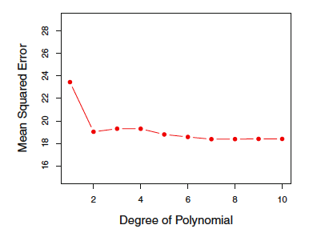
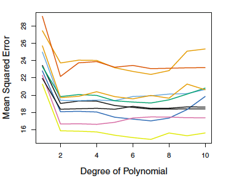

## Measuring Model Fit

One metric for measuring model fit is the mean squared error, given by $$MSE=\frac{1}{n}\sum_{i=1}^n (y_i-\widehat{y}_i)^2.$$ This value will be small when our predictions $\widehat{y}_i$ are close to the true values $y_i$.

Data used in model development are often called *training data*, and the MSE called the *training MSE*. Ideally, our model would also work well for new data $(x_0, y_0)$: what does our model tell us about what might happen in the future?  

## Training and Test Data

If we have a large amount of data, we can split our sample into training and test datasets. The test dataset should contain new observations that are not represented in the training dataset. Then a goal is to minimize the *test MSE*, given by $$MSE=\frac{1}{n_{train}}\sum_{i=1}^{n_{train}} (y_{0j}-\widehat{y}_{0j})^2,$$ where $\widehat{y}_{0j}$ is the predicted response for a new observation in the test dataset using the model developed in the training dataset, and $n_{train}$ is the number of new observations in the test dataset.

## Training and Test Data

Test data are important because of the problem of *overfitting*, which arises when the model is working too hard to find the perfect predictions in the test data and is not broadly generalizable because it has been picking up some patterns that are just reflecting random error. Note, however, that we generally expect the test MSE to be somewhat larger than the training MSE because our model has been developed to minimize the training MSE; overfitting refers to a situation in which a different model (generally a simpler one) fit to the training data would result in a smaller test MSE.

## Evaluating Test MSE

James et al (2013) consider test MSE for a variety of polynomial functions of a predictor variable $x$.

{width=40%}

While it is difficult to choose between higher-order polynomials, it is clear that a linear term in $x$ is insufficient.

## Evaluating test MSE

In a small dataset, the random split of the data can have considerable impact on the results, as seen in this figure (also from James) that shows results from 10 different random 50:50 training:test data splits in a sample of just under 400 observations.

{width=40%}

## Cross-Validation

*Cross-validation* is related to the validation set method but addresses the issue of sensitivity of results to the particular random data split obtained.  *k-Fold cross-validation* involves splitting the data into $k$ mutually-exclusive groups, called *folds*, and then fitting a model on $k-1$ folds (combined) with the $k^{th}$ fold treated as a validation set. We repeat $k$ times (so each fold can be the validation set). We obtain $k$ estimates of the test error and summarize using the average $$\frac{1}{k}\sum_{i=1}^k MSE_i.$$  *Leave-one-out cross-validation*, in which $k=1$, is a special case (more computationally intensive except in special cases). Test error estimates using $k=5$ or $k=10$ have been shown to have good statistical properties, motivating these common choices.

## Leave-one-out cross-validation

In the case of least squares, we can get an estimate of the average MSE from leave-one-out cross-validation using a simple formula (sadly, this does not hold in other models) based on the fit of only one model! This is a great computational savings. The estimate is given by
$$\frac{1}{n}\sum_{i=1}^n \left(\frac{y_i-\widehat{y}_i}{1-h_i}\right)^2,$$ where $h_{ii}$ is the $i$th diagonal matrix of the hat matrix $X(X'X)^{-1}X'$ and is often termed the *leverage*. High leverage points tend to have more of an impact on model fit.

## In-class exercise

- Subset the birth data to the year 2015 singleton births
- Divide the data into $k$ folds, where $k$ is the number of group members present, and assign each group member a different validation set (setting) a seed may be helpful)
- Each member should fit a linear regression model with birthweight as the outcome and predictors including biological sex, total pregnancies (dichotomized as 1 or >1), smoking status (dichotomized as any versus none), and gestational age (linear term in weeks) on their particular training set and compute the test MSE in their assigned validation set
- Combine results across team members to get the average test MSE
- Now compute average test MSE for a variety of polynomial functions in gestational age to determine a preferred model
