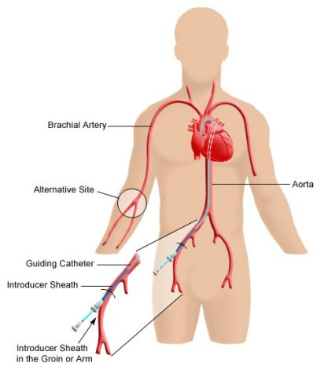

## Case Study 5: Survival After Cardiac Catheterization

*Cardiac catheterization* is a procedure used to provide information on how well the heart is working. A hollow tube, called a catheter, is inserted into the circulatory system, usually through the groin, and is passed into the heart and coronary arteries using X-ray images as a guide. These procedures are used when heart conditions are suspected in symptomatic individuals.

## Cardiac Catheterization

## Survival After Cardiac Catheterization

In this case study, we will examine factors related to survival in a group of Duke patients, all of whom have undergone cardiac catheterization. While cardiac catheterization itself would not be expected to lead to death, the group of individuals undergoing the procedure represent more generally a high-risk group of individuals.

## Case Study Data

You will analyze data on survival in XXX individuals undergoing cardiac catheterization at Duke from YEAR to YEAR. Relevant variables include the following.

- Year of catheterization procedure (proxy for standards of medical care at the time)
- Age group (categorized to prevent disclosure of individual identities)
- Gender (average survival is longer in women than in men)
- Race (classified as black, white, or other, based on demographics in Durham during much of the period under study)

## Case Study Data

- Smoking status (ever or never)
- Body mass index (weight in kg divided by height in m squared; normal weight is considered a BMI of [18.5,25); overweight a BMI of [25,30), and obese a BMI>=30)
- Medical history including history of cerebrovascular disease (e.g., stroke), congestive heart failure, chronic obstructive pulmonary disease, diabetes, hypertension, myocardial infarction, or hyperlipidemiak

## Case Study Data

Heart health indicated by findings upon examination, including

- severity of congestive heart failure
- S3 gallop (normal in people under 40 and in some athletes, in others it may indicate congestive heart failure)
- maximum percent stenosis of the left main coronary artery (stenosis is narrowing of the artery, usually the result of build-up of plaque)
- left ventricular ejection fraction (amount of blood pumped out of left ventricle each time it contracts; normal is 55-70%; lower values indicate poorer heart function)
- number of diseased vessels (missing if no arteriograms were performed during catheterization, it represents the number of significantly blocked major vessels, ranging from 0-3)

## Case Study Data

The outcome of survival time is defined by two variables: whether death occurred (DEATH) and the time to either death or the end of follow-up (DAYS2LKA).

## Case Study Goals

- determining which factors are associated with survival

- characterizing the relationship between each factor and survival

- exploring whether missing data are informative and affect analysis results and determining how to proceed with analysis in light of missing data

## Task for Case Study 5 Interim Report

- Produce a 5 page (maximum) report in R markdown that explores the missing data patterns and mechanisms to the extent possible based on the data provided. Comment on the potential for missing data to bias analysis results.

## Task for Case Study 5 Final Report

- Produce a 5 page (maximum) report in R markdown that explores factors related to survival in this cohort. Your analysis should account for missing data in a principled manner designed to limit potential bias in results.

